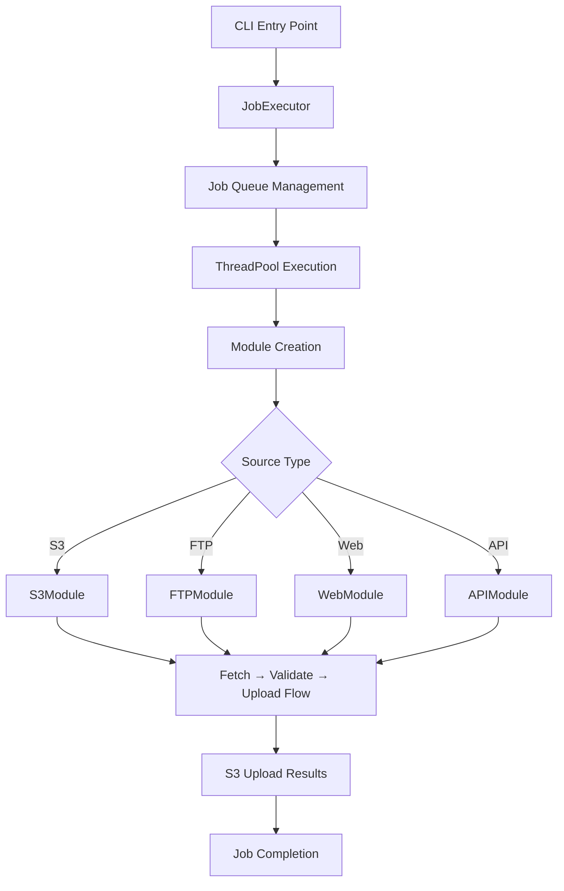
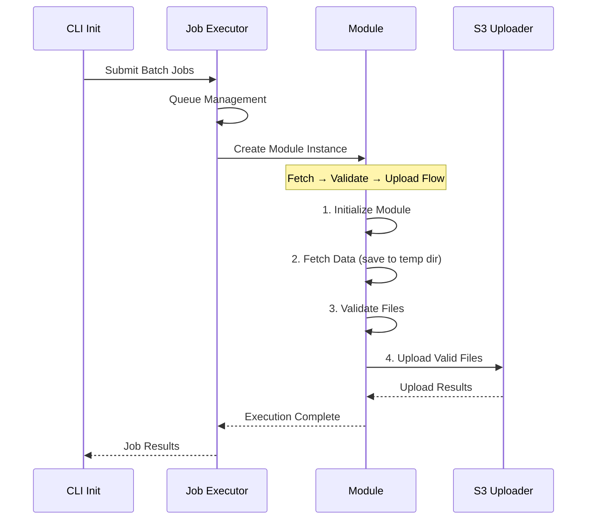
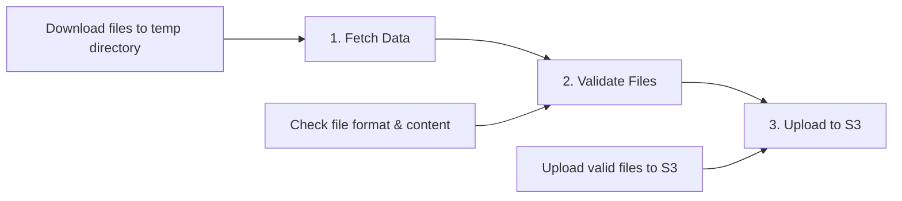

# Module System

A modular data processing system supporting multiple source types (S3, FTP, Web, API) with centralized orchestration and parallel execution. The system follows a **Fetch → Validate → Upload** workflow for processing data from various sources.

## 🏗️ **System Architecture**



## 🔄 **Execution Flow**



## 📁 **Project Structure**

```
module_system/
├── 📁 docs/                         # Documentation
│   ├── SYSTEM_ARCHITECTURE.md
│   ├── SOURCE_TYPE_FLOWS.md
│   └── IMPROVED_HTML_FLOWS.md
├── 📁 modules/                     # Source-specific modules
│   ├── s3_module/
│   │   ├── main.py                  # S3 implementation
│   │   └── exceptions/              # S3-specific errors
│   ├── ftp_module/
│   │   ├── main.py                  # FTP implementation
│   │   └── exceptions/              # FTP-specific errors
│   ├── web_module/
│   │   ├── main.py                  # Web scraping implementation
│   │   └── exceptions/              # Web-specific errors
│   └── api_module/
│       ├── main.py                  # API implementation
│       └── exceptions/              # API-specific errors
├── 📁 orchestrator/                 # Job orchestration
│   ├── job_executor.py              # Thread pool job execution
│   ├── cli_init.py                  # CLI interface
│   └── project_registry.yaml       # Project configuration
├── 📁 common/                       # Shared utilities
│   ├── interfaces/
│   │   └── base_module.py          # Base module interface
│   ├── exceptions/                  # Common error types
│   ├── logger.py                    # Structured logging
│   ├── s3_uploader.py              # S3 upload utilities
│   └── job_config.py               # Job configuration
├── 📁 tests/                        # Test suite
├── 📄 test_system.py               # Demo entry point
├── 📄 demo_batch_jobs.json         # Sample batch configuration
├── 📄 requirements.txt             # Dependencies
└── 📄 README.md                    # This file
```

## 🚀 **Quick Start**

### **Run Batch Job Demo**
```bash
# Install dependencies
pip install -r requirements.txt

# Run demo with sample batch jobs
python test_system.py
```

### **Direct CLI Usage**
```bash
# Execute batch jobs from custom file
python -m orchestrator.cli_init --batch-file your_jobs.json --max-workers 10
```

## 📋 **Batch Job Configuration**

Create a JSON file with job definitions:

```json
{
  "description": "Your batch job description",
  "jobs": [
    {
      "job_id": "unique_job_001",
      "service_id": "s3_financial_data"
    },
    {
      "job_id": "unique_job_002", 
      "service_id": "web_news_scraper"
    },
    {
      "job_id": "unique_job_003",
      "service_id": "api_weather_data"
    }
  ]
}
```

## 🔧 **Module Implementation Details**

### **Fetch → Validate → Upload Flow**

Each fetcher follows a standardized 3-step process:



### **Current Module Types**

| Module | Source | File Types | Validation | Upload Path |
|---------|--------|------------|------------|-------------|
| **S3Module** | AWS S3 Bucket | JSON files | Schema validation | `data/s3/{service_id}/validated/` |
| **FTPModule** | FTP Server | CSV files | Format validation | `data/ftp/{service_id}/validated/` |
| **WebModule** | Web Pages | HTML files | Structure validation | `data/web/{service_id}/scraped/` |
| **APIModule** | REST APIs | JSON responses | Schema validation | `data/api/{service_id}/responses/` |

## ⚙️ **Configuration**

### **Command Line Options**
```bash
python -m orchestrator.cli_init [OPTIONS]

Required:
  --batch-file FILE     JSON file containing batch job definitions

Optional:
  --max-workers N       Maximum parallel workers (default: 20)
  --monitor-duration N  Monitoring duration in seconds (default: 30)
```

### **Environment Variables**
- Set up AWS credentials for S3 operations
- Configure logging levels and output paths

## 📊 **Monitoring & Logging**

The system provides comprehensive logging:

- **Console Output**: Real-time execution progress
- **File Logs**: Detailed logs in `temp/logs/` directory
  - `system_orchestrator_job_executor.log` - Job execution details
  - `{job_id}_{service_id}_{fetcher}.log` - Individual fetcher logs

### **Real-time Statistics**
- Total jobs submitted/completed/failed
- Currently running jobs
- Queue size and processing rates
- Success/failure rates

## 🔄 **Concurrency Management**

- **Thread Pool**: Configurable worker pool (default: 20 workers)
- **Queue Management**: FIFO job processing with thread-safe operations
- **Resource Management**: Automatic cleanup of temporary files
- **Error Handling**: Comprehensive error tracking and recovery

## 📈 **Current Status & TODO**

### ✅ **Completed Features**
- [x] Multi-threaded job execution with ThreadPoolExecutor
- [x] Thread-safe job queue management
- [x] Batch job processing from JSON configuration
- [x] Structured logging with job context
- [x] Base fetcher interface with standardized workflow
- [x] CLI interface for job orchestration
- [x] Real-time execution monitoring
- [x] Comprehensive error handling and statistics

### 🚧 **TODO - Implementation Needed**

#### **High Priority**
- [ ] **Real S3 Operations**: Replace dummy S3 client with actual boto3 implementation
- [ ] **Real FTP Client**: Implement actual FTP file download using ftplib
- [ ] **Web Scraping**: Implement requests/selenium for actual web scraping
- [ ] **API Integration**: Implement HTTP client for real API calls
- [ ] **File Validation**: Add real validation logic for each file type
- [ ] **S3 Upload Integration**: Connect s3_uploader with real AWS S3

#### **Medium Priority**
- [ ] **Configuration Management**: Replace dummy job config with real API integration
- [ ] **Error Recovery**: Implement retry mechanisms for transient failures
- [ ] **Monitoring Dashboard**: Add web interface for job monitoring
- [ ] **Authentication**: Add support for various authentication methods
- [ ] **Rate Limiting**: Implement rate limiting for API calls

#### **Low Priority**
- [ ] **Docker Support**: Complete containerization setup
- [ ] **Unit Tests**: Expand test coverage for all components
- [ ] **Performance Optimization**: Add caching and optimization features
- [ ] **Documentation**: Add API documentation and usage examples

### 🎯 **Implementation Guidelines**

1. **Replace TODO comments** in fetcher implementations with actual logic
2. **Update configuration** in `common/job_config.py` with real API endpoints
3. **Implement authentication** for each source type (AWS credentials, API keys, etc.)
4. **Add proper error handling** for network failures, authentication errors, etc.
5. **Test with real data sources** to validate the complete workflow

## 🤝 **Team Integration**

The modular design allows parallel development:

- **Person A (Web Crawler)**: Focus on `fetchers/web_fetcher/main.py`
- **Person B (S3/FTP)**: Focus on `fetchers/s3_fetcher/` and `fetchers/ftp_fetcher/`
- **Person C (API/Integration)**: Focus on `fetchers/api_fetcher/` and `common/job_config.py`

## 📚 **Additional Documentation**

- [System Architecture](docs/SYSTEM_ARCHITECTURE.md) - Detailed system design
- [Source Type Flows](docs/SOURCE_TYPE_FLOWS.md) - Individual fetcher workflows
- [HTML Processing Flows](docs/IMPROVED_HTML_FLOWS.md) - Web scraping specifics

## 🐛 **Troubleshooting**

### **Common Issues**
- **Import Errors**: Ensure all dependencies are installed via `pip install -r requirements.txt`
- **Permission Errors**: Check AWS credentials and file system permissions
- **Thread Errors**: Verify max_workers setting doesn't exceed system limits

### **Debug Mode**
Enable detailed logging by setting environment variables:
```bash
export LOG_LEVEL=DEBUG
python test_system.py
```

---

**The orchestration framework is complete and production-ready. Focus on implementing the TODO items to connect with real data sources.**
