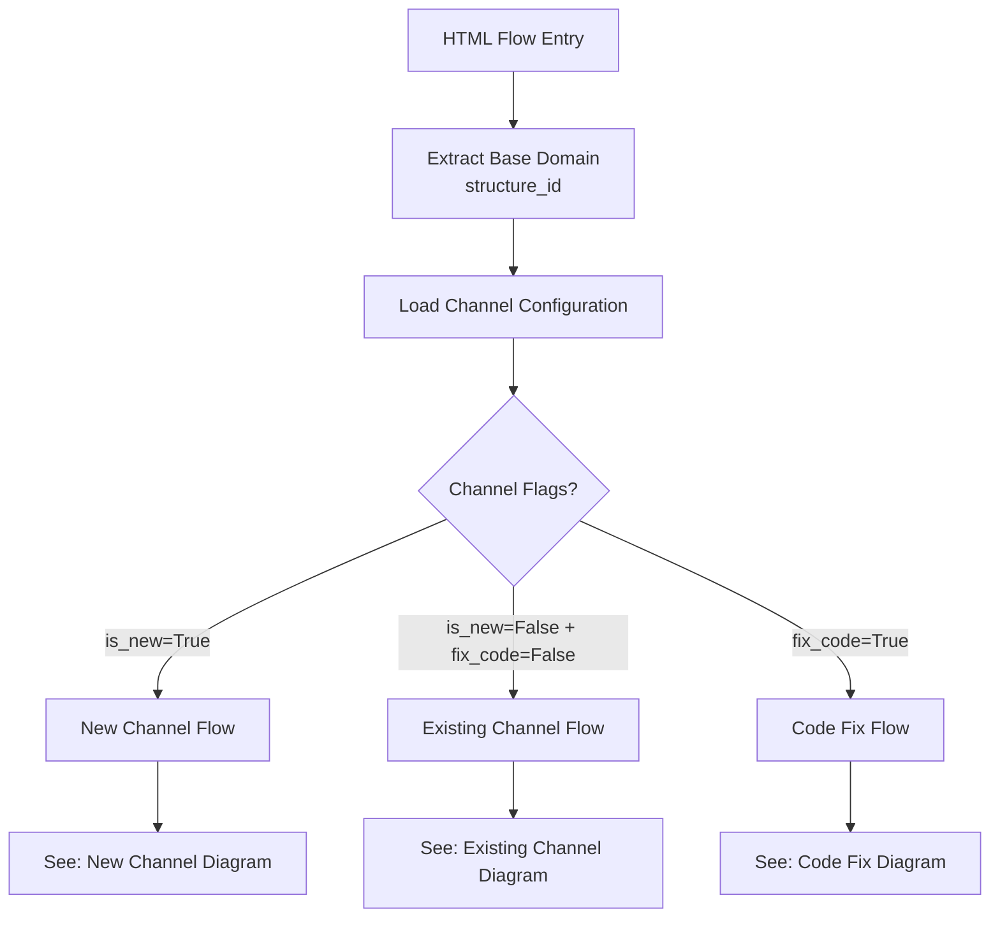
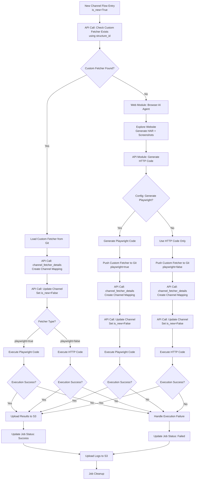
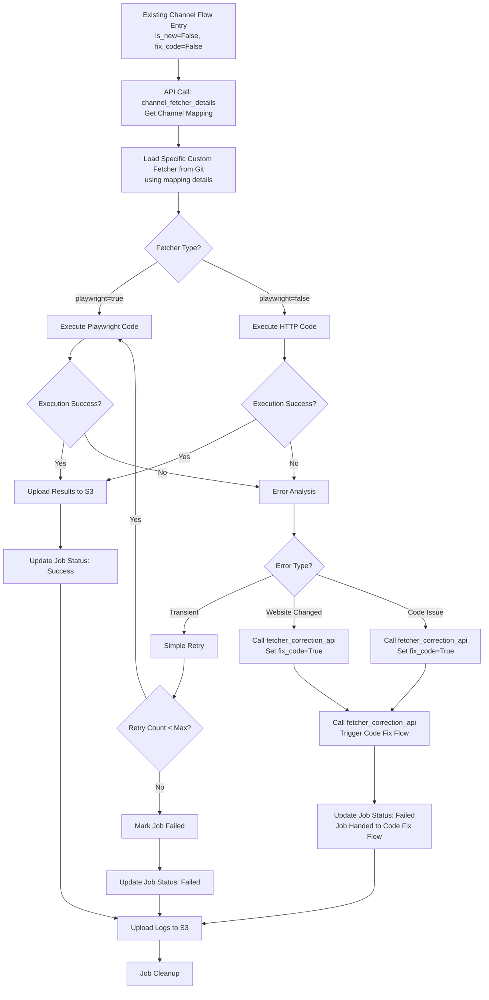
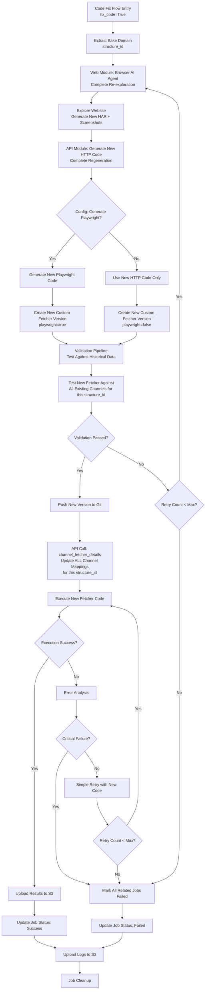
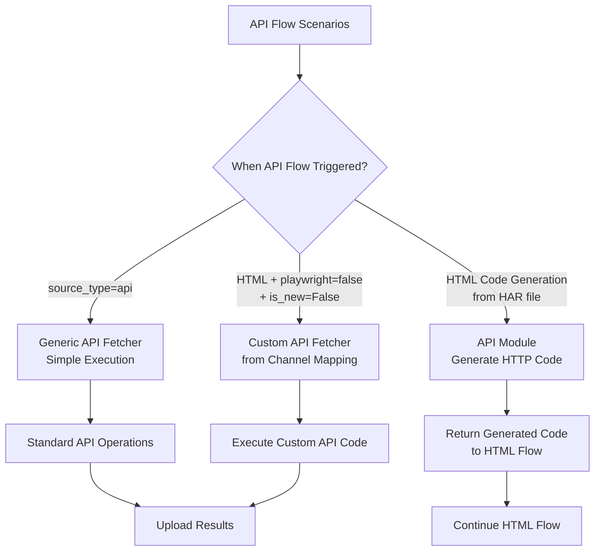

# Improved HTML Flow Architecture

This document contains the improved HTML flow broken down into simple, understandable diagrams based on channel flags (`is_new`, `fix_code`).

## HTML Flow Main Router

**Central routing logic for HTML source type based on channel configuration flags**



---

## 1. New Channel Flow (`is_new=True`)

**Flow for newly registered channels that need custom fetcher discovery and mapping**



**Key Operations:**
- Custom fetcher discovery using `structure_id`
- Channel-to-fetcher mapping creation
- Channel flag updates (`is_new=False`)
- New fetcher generation if needed

---

## 2. Existing Channel Flow (`is_new=False`, `fix_code=False`)

**Simple execution flow for existing channels with established fetcher mappings**



**Key Operations:**
- Direct fetcher loading using channel mapping
- Execution with targeted error handling
- Automatic escalation to code fix mode when needed

---

## 3. Code Fix Flow (`fix_code=True`)

**Complete fetcher regeneration flow triggered when existing fetchers fail due to website changes**



**Key Operations:**
- Complete fetcher regeneration from scratch
- Validation against historical data for ALL channels
- Bulk update of channel mappings
- Comprehensive testing before deployment

---

## API Flow Integration Points

**Simplified API flow connections with HTML flow**



**API Flow Characteristics:**
- **Simple**: No complex branching like HTML flow
- **Generic Focus**: Primarily uses generic API fetcher
- **HTML Integration**: Generates HTTP code for HTML flow when needed

---

## Flow Decision Matrix

| Scenario | is_new | fix_code | Flow Type | Key Operations |
|----------|--------|----------|-----------|----------------|
| **New Channel Registration** | True | False | New Channel Flow | Fetcher discovery, mapping creation |
| **Regular Execution** | False | False | Existing Channel Flow | Direct execution using mapping |
| **Website Changed** | False | True | Code Fix Flow | Complete regeneration, validation |
| **API Source** | N/A | N/A | API Flow | Generic API operations |

## Configuration Examples

### New Channel Config
```yaml
channel_id: "12345"
source_type: "html"
is_new: true
fix_code: false
url: "https://example.com/data"
```

### Existing Channel Config
```yaml
channel_id: "12345"
source_type: "html"
is_new: false
fix_code: false
fetcher_mapping_id: "example_com_v2"
```

### Code Fix Config
```yaml
channel_id: "12345"
source_type: "html"
is_new: false
fix_code: true
structure_id: "example.com"
reason: "website_structure_changed"
```

## Benefits of This Structure

1. **Clear Separation**: Each scenario has its own focused diagram
2. **Easy Understanding**: No complex branching in single diagram
3. **Targeted Development**: Teams can work on specific scenarios
4. **Better Testing**: Each flow can be tested independently
5. **Maintenance**: Easy to modify individual flows without affecting others

## Next Steps

1. **Review each flow diagram** for accuracy and completeness
2. **Validate API integration points** with HTML flows
3. **Define detailed interfaces** between components
4. **Create implementation TODOs** for each flow type
5. **Merge approved diagrams** into main SOURCE_TYPE_FLOWS.md file
