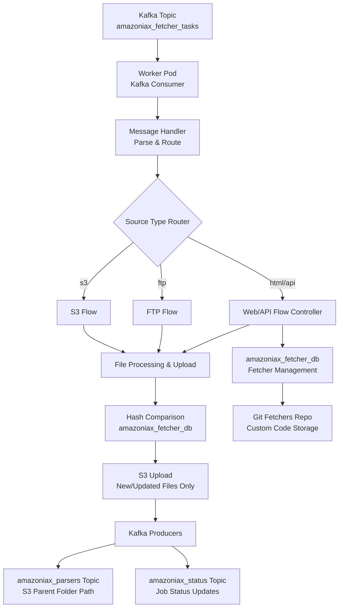
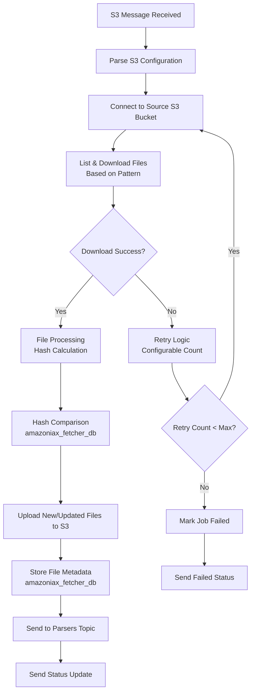
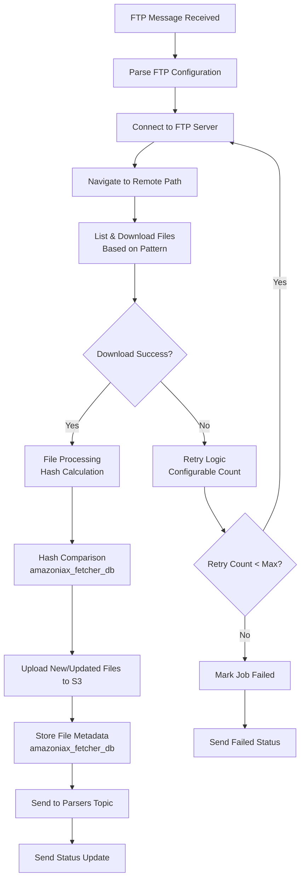
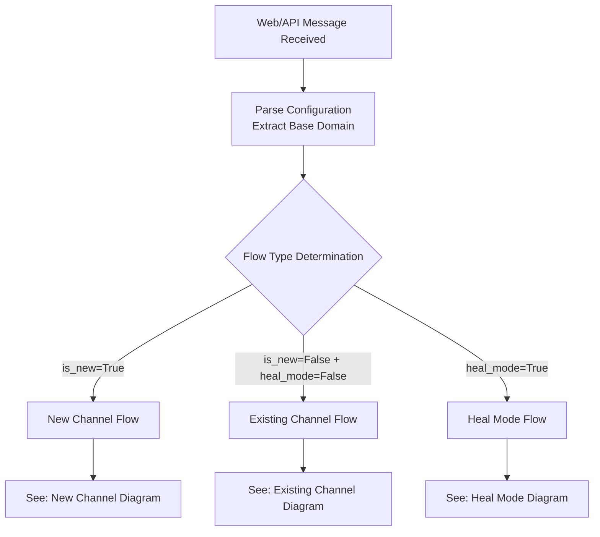
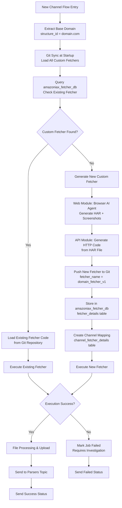
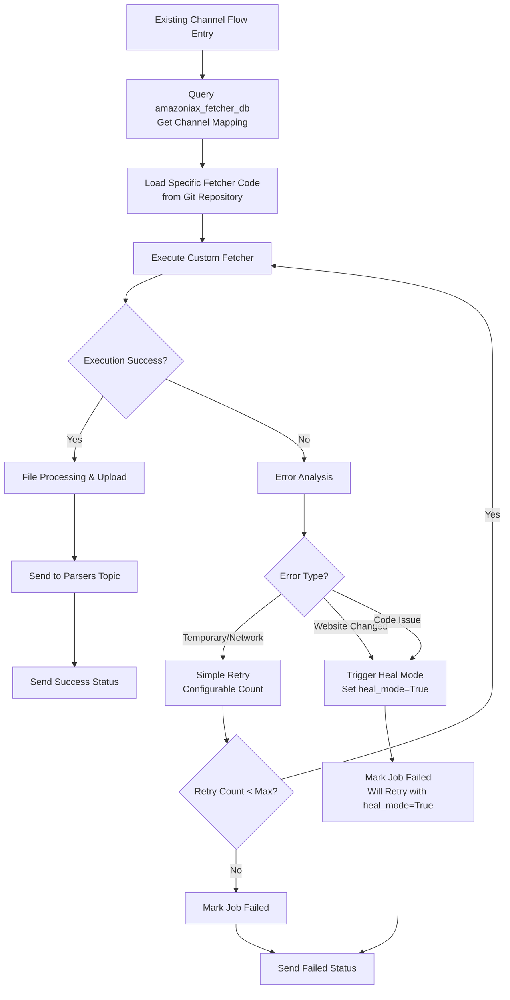
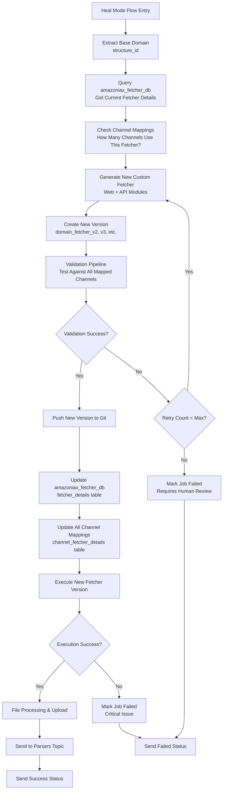
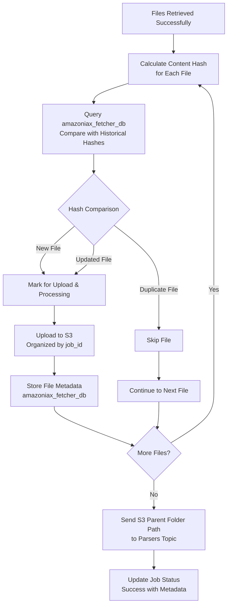

# Microservice Architecture - Fetcher Service Flows

## Overview
A microservice-based data fetching system that polls Kafka for tasks, processes different source types, and outputs results to S3 and downstream Kafka topics. The service maintains its own database (`amazoniax_fetcher_db`) for independent scaling and fetcher management.

## High-Level System Architecture



---

## Kafka Message Schemas

### Input Topic: `amazoniax_fetcher`
```json
{
  "job_id": "job_12345",
  "channel_id": "001",
  "source_type": "html|api|s3|ftp",
  "is_new": true,
  "heal_mode": false,
  "config": {
    // Source-specific configuration (see below)
  }
}
```

### Output Topic: `amazoniax_parsers`
```json
{
  "job_id": "job_12345",
  "channel_id": "001",
  "s3_output_path": "s3://bucket/path/to/job_12345/",
  "file_count": 15,
  "timestamp": "2025-08-12T08:30:00Z"
}
```

### Status Topic: `amazoniax_status`
```json
{
  "job_id": "job_12345",
  "channel_id": "ch_001",
  "status": "success|failed|requires_human_review",
  "message": "Job completed successfully",
  "timestamp": "2025-08-12T08:30:00Z",
  "metadata": {
    "files_processed": 15,
    "execution_time_seconds": 120
  }
}
```

---

## Source Type Configuration Schemas

### S3 Configuration
```json
{
  "bucket": "source-bucket",
  "remote_path": "/data/files/",
  "access_key": "AKIA...",
  "secret_access_key": "secret...",
  "file_pattern": "*.csv",
  "other_optional_fields": ""
}
```

### FTP Configuration
```json
{
  "host": "ftp.example.com",
  "username": "user",
  "password": "pass",
  "remote_path": "/data/files/",
  "file_pattern": "*.xml",
  "other_optional_fields": ""
}
```

### HTML/API Configuration
```json
{
  "url": "https://example.com/data",
  "channel_name": "Example Channel",
  "login_credentials": {
    "username": "user",
    "password": "pass"
  },
  "navigation_details": {
    "date_range": "7_days",
    "filters": ["sports", "news"]
  },
  "api_documentation_path": "",
  "auth_keys": {
    "api_key": "key123",
    "bearer_token": "token456"
  }
  ,
  "other_optional_fields": ""
}
```

---

## Flow 1: S3 Source Type

**Simple and direct flow for S3 operations**



---

## Flow 2: FTP Source Type

**Simple and direct flow for FTP operations**



---

## Flow 3: Web/API Source Type - Main Controller

**Unified flow for HTML and API sources with intelligent routing**



---

## Flow 3A: New Channel Flow (`is_new=True`)

**Discovery and initial setup for new channels**



---

## Flow 3B: Existing Channel Flow (`is_new=False`)

**Standard execution for established channels**



---

## Flow 3C: Heal Mode Flow (`heal_mode=True`)

**Complete fetcher regeneration with validation**



---

## File Processing & Deduplication Flow

**Common flow for all source types after successful data retrieval**



---

## Database Tables (High-Level)

### `fetcher_details`
- `id`, `structure_id` (domain.com), `fetcher_name`, `version`, `created_at`

### `channel_fetcher_details`
- `id`, `channel_id`, `fetcher_id` (FK), `config_json`, `created_at`

### `job_runs`
- `id`, `job_id`, `channel_id`, `status`, `metadata_json`, `created_at`

### `file_metadata`
- `id`, `job_id`, `file_path`, `content_hash`, `file_size`, `created_at`

---

## Key Design Decisions

### 1. **Unified Web/API Flow**
- Both HTML and API sources follow the same discovery and execution pattern
- Web Module generates HAR files, API Module converts to HTTP code
- Single fetcher management system for both types

### 2. **Independent Database**
- `amazoniax_fetcher_db` provides complete independence from upstream services
- Enables independent scaling and deployment
- Stores all fetcher metadata and job history

### 3. **Git-Based Code Storage**
- Custom fetchers stored in separate Git repository
- Versioning strategy: `domain_fetcher_v1`, `domain_fetcher_v2`
- Sync at startup ensures latest code availability

### 4. **Intelligent Deduplication**
- Content-based hashing prevents duplicate processing
- Historical comparison across all job runs
- Only new/updated files sent to parsers

### 5. **Validation Pipeline**
- Triggered only during heal_mode for safety
- Tests new fetchers against all mapped channels
- Prevents deployment of faulty code

## Configuration Management

### Retry Configuration (Database Stored)
```json
{
  "max_simple_retries": 3,
  "max_heal_retries": 2,
  "retry_delay_seconds": 30
}
```

### Git Configuration
```json
{
  "fetchers_repo_path": "/fetchers",
  "sync_on_startup": true,
  "auto_commit": true
}
```

## Error Handling Summary

| Error Type | Action | Next Step |
|------------|--------|-----------|
| **Network/Temporary** | Simple Retry | Configurable retry count |
| **Website Changed** | Trigger Heal Mode | New job with heal_mode=True |
| **Code Generation Failed** | Retry Generation | Max retries → Human Review |
| **Validation Failed** | Retry Generation | Max retries → Human Review |
| **Critical Execution Error** | Immediate Failure | Human Review Required |

## Benefits of This Architecture

1. **Simplicity**: Clear separation of concerns with focused flows
2. **Scalability**: Independent microservice with own database
3. **Reliability**: Comprehensive validation and retry mechanisms
4. **Maintainability**: Unified Web/API flow reduces complexity
5. **Efficiency**: Smart deduplication prevents unnecessary processing
6. **Flexibility**: Configurable retry and validation parameters
