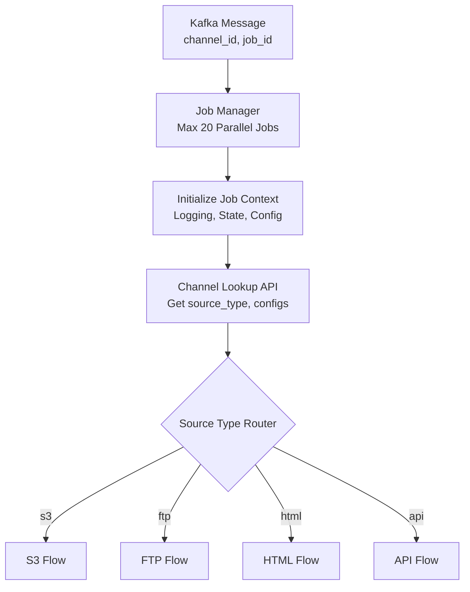
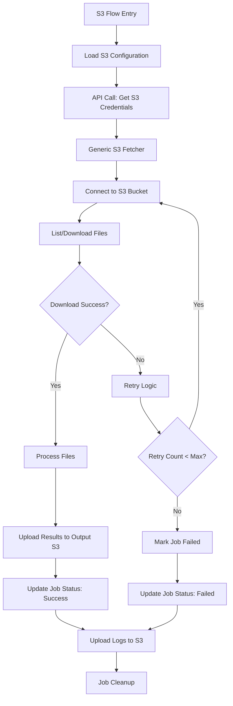
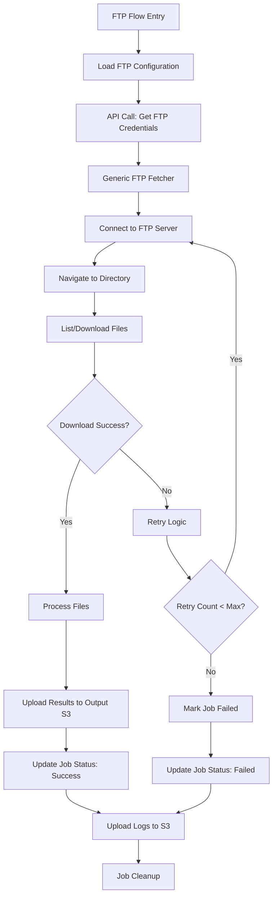
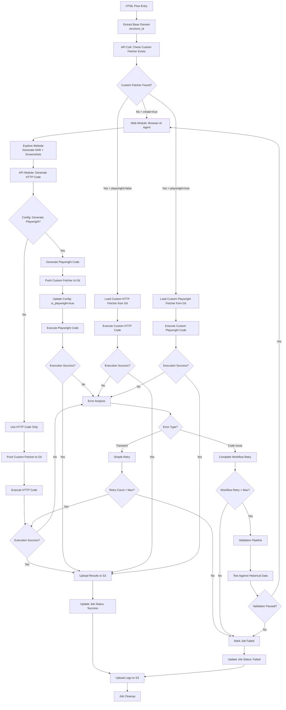
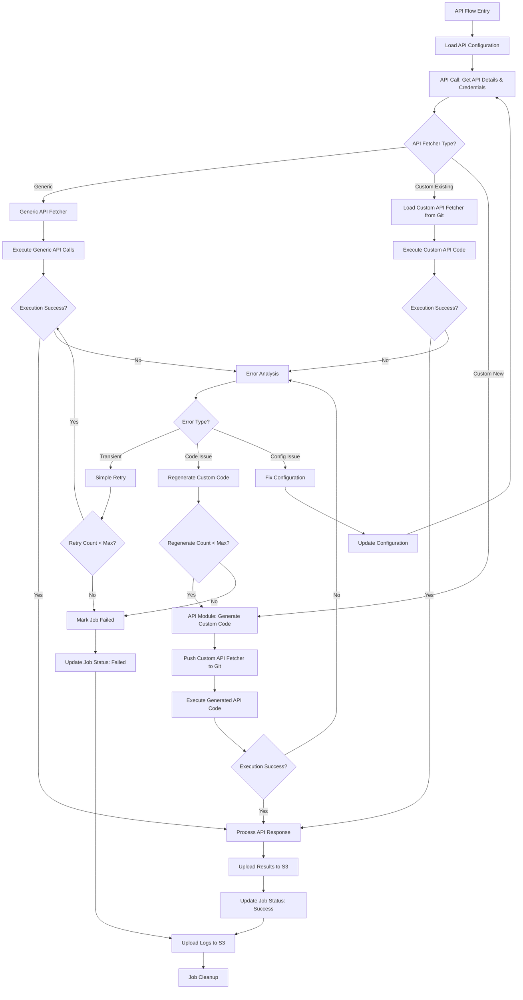
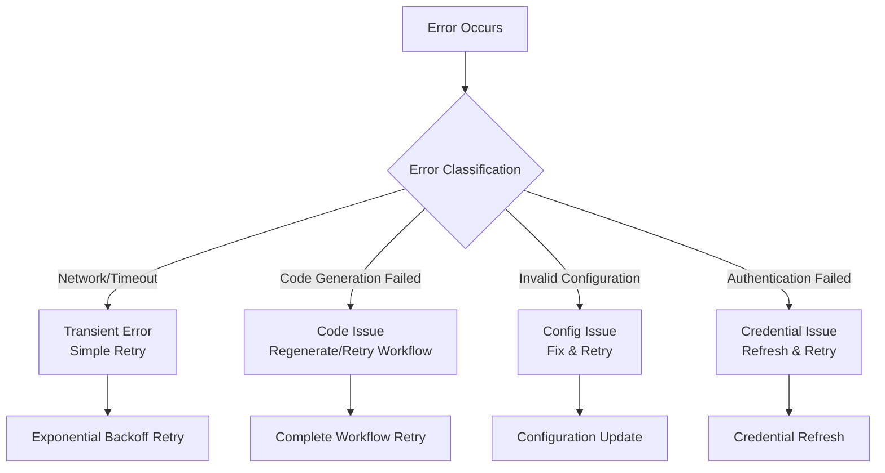

# Source Type Specific Flow Architectures

This document contains clean, focused architecture diagrams for each source type to make it easier to understand, review, optimize, and track individual flows.

## Common Entry Point

All source types start with the same entry flow:

---

## 1. S3 Source Type Flow

**Simple and Direct Flow for S3 Operations**

**Key Components:**
- `fetchers/s3_fetcher/config.py` - S3 configuration management
- `fetchers/s3_fetcher/fetch.py` - Core S3 operations
- `common/s3_uploader.py` - Output upload functionality

---

## 2. FTP Source Type Flow

**Simple and Direct Flow for FTP Operations**

**Key Components:**
- `fetchers/ftp_fetcher/config.py` - FTP configuration management
- `fetchers/ftp_fetcher/fetch.py` - Core FTP operations
- `common/s3_uploader.py` - Output upload functionality

---

## 3. HTML Source Type Flow

**Complex Flow with Custom Fetcher Management and LLM Integration**

**Key Components:**
- `fetchers/web_fetcher/` - Browser AI agent and Playwright execution
- `fetchers/api_fetcher/` - HTTP code generation from HAR
- `common/git_integration/` - Custom fetcher storage and retrieval
- `common/validation_pipeline/` - Historical data validation
- `common/structure_id_generator.py` - Base domain extraction

---

## 4. API Source Type Flow

**Flexible Flow for Generic and Custom API Operations**

**Key Components:**
- `fetchers/api_fetcher/` - Generic and custom API operations
- `common/git_integration/` - Custom API fetcher storage
- `common/api_configuration_manager.py` - API type determination

---

## Flow Comparison Summary

| Source Type | Complexity | Custom Code | LLM Usage | Git Integration | Validation Pipeline |
|-------------|------------|-------------|-----------|-----------------|-------------------|
| **S3** | Low | No | No | No | No |
| **FTP** | Low | No | No | No | No |
| **HTML** | High | Yes | Yes | Yes | Yes |
| **API** | Medium | Optional | Optional | Optional | No |

## Common Error Handling Patterns

All flows use consistent error handling:

## Next Steps

1. **Review each flow individually** for accuracy and completeness
2. **Optimize specific flows** based on requirements
3. **Add missing scenarios** to individual flows
4. **Define interfaces** between components
5. **Create implementation TODOs** for each source type

Each flow can now be developed, tested, and maintained independently while sharing common components and patterns.
