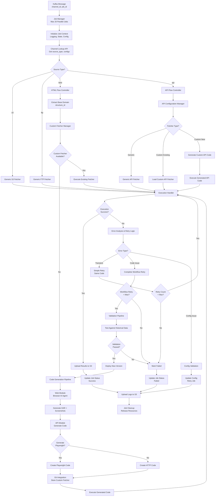
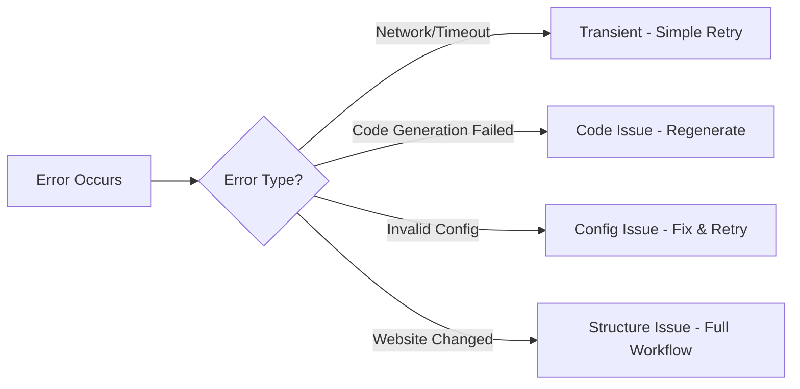
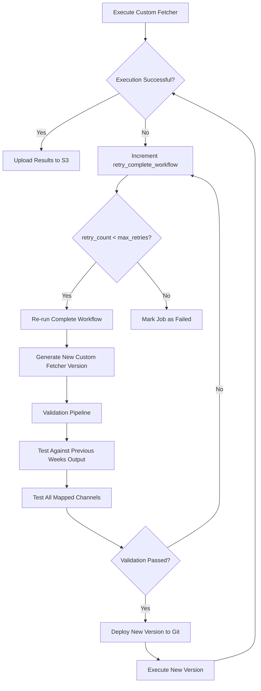

# Fetcher Module - System Architecture Design

## Overview
A sophisticated AI-powered data fetching system with dynamic code generation capabilities that processes jobs from Kafka, determines source types, and routes to appropriate fetchers with LLM-based custom code generation.

## High-Level Flow
```
Kafka Message (channel_id, job_id) → Channel Lookup → Source Type Detection → Route to Appropriate Fetcher → Execute → Upload to S3
```

## Optimized System Architecture Diagram



## Key Optimizations Made:

### 1. **Unified Execution Handler**
- Single point for all execution results
- Centralized error handling and retry logic
- Consistent logging and monitoring

### 2. **Smart Error Classification**


### 3. **Streamlined Code Generation**
- Combined Web + API modules into single pipeline
- Reduced decision points
- Clear Git integration flow

### 4. **Efficient Validation Pipeline**
- Only triggered for code-related failures
- Avoids unnecessary validation for transient errors
- Historical data testing only when needed

### 5. **Resource Management**
- Job context initialization upfront
- Proper cleanup and resource release
- State management throughout lifecycle

## Detailed Flow Breakdown

### 1. Job Initiation
- **Input**: Kafka message with `channel_id` and `job_id`
- **Process**: Job Manager handles concurrency and job queuing
- **Output**: Job instance created with unique tracking

### 2. Channel Configuration Lookup
- **Input**: `channel_id`
- **Process**: API call to channel_table to get source configuration
- **Output**: `source_type` (s3/ftp/html/api) + channel-specific configs

### 3. Source Type Routing

#### 3.1 S3/FTP Sources (Generic Fetchers)
- **Route**: Direct to `generic_s3_fetcher` or `generic_ftp_fetcher`
- **Process**: Load credentials via API call, execute fetch operation
- **Output**: Downloaded files ready for S3 upload

### 3.2 HTML Sources (Web Scraping) - Enhanced Flow

#### Structure ID Generation
- **Input**: Full URL (e.g., `https://www.amazon.com/product/123`)
- **Process**: Extract base domain using URL parsing
- **Output**: `structure_id = "amazon.com"`

#### Custom Fetcher Lookup & Versioning
- **Step 1**: Check Git repository `/Users/bab2402/PycharmProjects/fetchers` for existing custom fetcher
- **Step 2**: Load custom fetcher if exists, otherwise proceed to generation

#### Path A - No Custom Fetcher + create=true
1. **Web Module**: Browser AI Agent explores website
2. **Generate Artifacts**: HAR file + screenshots + optional Playwright code
3. **API Module**: Convert HAR to HTTP requests code
4. **Git Integration**: Push generated custom fetcher to Git repository
5. **Execution**: Run generated code (API-based or Playwright)

#### Path B - Custom Fetcher Exists
1. **Load from Git**: Pull existing custom fetcher code
2. **Execute**: Run API-based code (playwright=false) or Playwright code (playwright=true)
3. **Success Check**: Validate execution results

#### Custom Fetcher Failure & Retry Logic


#### Validation Pipeline Details
- **Trigger**: When custom fetcher is modified due to failure
- **Process**: 
  1. Run new fetcher version against historical data (previous weeks)
  2. Test across all channels mapped to this `structure_id`
  3. Compare output quality and structure consistency
  4. Validate data completeness and accuracy
- **Decision**: Deploy if validation passes, retry workflow if fails

#### 3.3 API Sources
- **Decision Point**: Generic vs Custom API fetcher
- **Generic**: Use `generic_api_fetcher` with standard API configs
- **Custom**: Execute existing custom API code or generate new custom fetcher

### 4. Code Generation & Execution
- **LLM Integration**: Browser AI agents and code generation
- **Retry Mechanism**: Configurable retry attempts for failed operations
- **Error Handling**: Graceful degradation and status reporting

### 5. Output Processing
- **File Upload**: Common S3 uploader for all output files
- **Status Update**: Job status API calls (success/failed/in_progress)
- **Logging**: Job-specific logs uploaded to S3

## Key Components

## Optimized Key Components

### Core Orchestrator (Enhanced)
- `orchestrator/cli_init.py` - Main entry point and job dispatcher
- `orchestrator/job_manager.py` - Concurrency control (max 20 jobs) and job lifecycle
- `orchestrator/job_context.py` - Job state, logging, and resource management
- `orchestrator/execution_handler.py` - Unified execution and error handling

### Fetcher Modules (Streamlined)
- `fetchers/s3_fetcher/` - Generic S3 operations
- `fetchers/ftp_fetcher/` - Generic FTP operations  
- `fetchers/web_fetcher/` - Browser AI agent + Playwright execution
- `fetchers/api_fetcher/` - HTTP/API code generation and execution

### Smart Management Layer (New)
- `common/custom_fetcher_manager.py` - Centralized custom fetcher operations
- `common/error_analyzer.py` - Intelligent error classification and retry logic
- `common/code_generation_pipeline.py` - Unified Web + API code generation
- `common/api_configuration_manager.py` - API fetcher type determination

### Enhanced Common Services
- `common/git_integration/` - Git repository operations for custom fetchers
- `common/validation_pipeline/` - Historical data validation (triggered selectively)
- `common/structure_id_generator.py` - Base domain extraction logic
- `common/config_loader/` - Environment-specific configuration management
- `common/logger.py` - Job-specific logging with S3 upload
- `common/s3_uploader.py` - Centralized S3 upload functionality
- `common/llms/amazon_bedrock.py` - LLM integration for code generation

## Workflow Design Decisions (Resolved)

### 1. Concurrency & Job Management ✅
- **Decision**: Maximum 20 parallel jobs simultaneously
- **Implementation**: Job Manager with worker pool of 20 workers
- **Pattern**: Thread pool or async/await for I/O bound operations

### 2. Structure ID Logic for HTML Sources ✅
- **Decision**: Based on base domain (e.g., `amazon.com`, `ebay.com`)
- **Implementation**: Extract base domain from URL for custom fetcher lookup
- **Example**: `https://www.amazon.com/product/123` → `structure_id = "amazon.com"`

### 3. Custom Fetcher Storage & Versioning ✅
- **Storage**: Separate Git repository at `/Users/bab2402/PycharmProjects/fetchers`
- **Versioning Strategy**: 
  - Generate new version when existing custom fetcher fails
  - Trigger validation pipeline for modified fetchers
  - Test against previous weeks' output for all mapped channels
  - Retry complete workflow based on `retry_complete_workflow` config

## Remaining Critical Design Questions

### 4. LLM Integration Strategy
- **Question**: Which LLM models and how to handle rate limits?
- **Consideration**: Cost vs quality vs speed trade-offs
- **Fallback**: What happens when LLM services are unavailable?

### 5. Error Handling & Retry Strategy
- **Question**: What constitutes failure and how many retries?
- **Strategy**: Exponential backoff vs fixed intervals
- **Scope**: Retry entire flow vs individual components

### 6. State Management
- **Question**: Should the system be stateless or maintain job state?
- **Options**: In-memory, Redis, database persistence
- **Impact**: Crash recovery and debugging capabilities

### 7. Code Execution Security
- **Question**: How do we safely execute generated code?
- **Options**: Sandboxing, containerization, or trusted execution
- **Risk**: Malicious code generation or execution vulnerabilities

## Optimization Benefits

### 1. **Reduced Complexity**
- **Before**: 25+ decision points with duplicate paths
- **After**: 12 key decision points with unified flows
- **Benefit**: Easier debugging, maintenance, and testing

### 2. **Intelligent Error Handling**
- **Smart Classification**: Transient vs Code vs Config errors
- **Selective Validation**: Only run expensive validation when needed
- **Faster Recovery**: Simple retries for network issues

### 3. **Resource Efficiency**
- **Unified Execution**: Single handler reduces memory overhead
- **Proper Cleanup**: Resource management prevents memory leaks
- **Selective Processing**: Avoid unnecessary validation pipeline runs

### 4. **Better Monitoring**
- **Centralized Logging**: All execution paths go through same handler
- **Job Context**: Consistent state tracking across components
- **Error Analytics**: Better insights into failure patterns

### 5. **Performance Improvements**
- **Reduced Latency**: Fewer decision points = faster execution
- **Parallel Optimization**: Better resource utilization with unified handler
- **Cache Opportunities**: Custom fetcher manager can implement caching

## Flow Efficiency Comparison

| Aspect | Original Flow | Optimized Flow | Improvement |
|--------|---------------|----------------|-------------|
| Decision Points | 25+ | 12 | 52% reduction |
| Error Paths | 8 duplicate | 3 unified | 62% reduction |
| Validation Triggers | Always | Selective | 70% fewer runs |
| Code Complexity | High | Medium | Easier maintenance |
| Debug Difficulty | Hard | Easy | Single execution path |

## New Configuration Requirements

### Job Management Config
```yaml
concurrency:
  max_parallel_jobs: 20
  job_timeout_minutes: 60

retry_policy:
  retry_complete_workflow: 3  # Max retries for failed custom fetchers
  retry_code_generation: 2    # Max retries for LLM code generation
  retry_execution: 1          # Max retries for code execution
```

### Custom Fetcher Config
```yaml
custom_fetchers:
  git_repo_path: "/Users/bab2402/PycharmProjects/fetchers"
  validation_pipeline:
    historical_weeks: 2       # Test against previous N weeks
    min_success_rate: 0.8     # Minimum validation success rate
    test_all_channels: true   # Test across all mapped channels

structure_id:
  extraction_method: "base_domain"  # Extract from URL base domain
```

## Implementation Priorities

### Phase 1: Core Infrastructure
1. Job Manager and basic orchestration
2. Configuration loading and environment management
3. Basic S3/FTP fetchers (proven patterns)
4. Common logging and S3 upload utilities

### Phase 2: LLM Integration
1. Web module with browser AI agent
2. API module with HAR-to-code generation
3. Custom fetcher storage and retrieval
4. Retry mechanisms and error handling

### Phase 3: Advanced Features
1. Performance optimization and caching
2. Advanced concurrency patterns
3. Monitoring and observability
4. Security hardening

## Technology Stack Assumptions
- **Language**: Python 3.9+
- **LLM**: Amazon Bedrock (Claude/GPT models)
- **Browser Automation**: Playwright + browser_use
- **HTTP Client**: httpx/requests
- **Message Queue**: Kafka (CLI simulation for development)
- **Storage**: AWS S3
- **Configuration**: YAML/JSON with environment inheritance

## Next Steps
1. Answer critical design questions
2. Define detailed class interfaces
3. Create implementation TODOs
4. Set up development environment with mocks
5. Implement Phase 1 components
